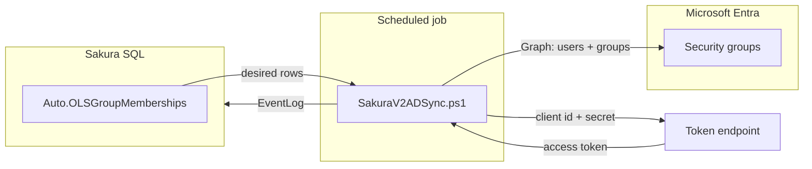

# SakuraV2 — AD Sync end to end

**Audience:** Operators and developers who must make **Entra group membership** match **Sakura’s approved permissions** using **`SakuraV2ADSync.ps1`**.

**Companion:** User sign-in and API tokens are a different path — see **`Docs/SAKURAV2_SPA_AND_API_ENTRA_END_TO_END.md`**. Quick Entra vs run-as Q&A: **`Docs/SAKURAV2_ENTRA_IDENTITIES_REFERENCE.md`**.

**Deeper technical reference (Graph calls, V1/V2, rotation):** **`Docs/AD_SYNC_DEEP_REFERENCE.md`**.

---

## 1. What problem AD Sync solves

Sakura stores **who should have access** (approved OLS / audience / report permissions) in **SQL**. Power BI / Fabric enforces access via **Entra ID security groups**. Those systems do not read the Sakura database.

**AD Sync** closes the gap: it reads the **desired** membership from the database, reads **current** membership from Microsoft Graph, then **adds** and **removes** users in the right groups so reality matches Sakura.

---

## 2. End-to-end flow (conceptual)

1. A scheduler (Task Scheduler, Azure DevOps, etc.) runs **`SakuraV2ADSync.ps1`** under some **Windows/pipeline account** (run-as).
2. The script connects to **SQL** and reads **`[Auto].[OLSGroupMemberships]`** (desired state: user email + Entra group object ID).
3. The script authenticates to Microsoft Graph using **application (client) credentials** — **no interactive user**: `TenantId` + `ClientId` + **`ClientSecret`**.
4. For each relevant group, it compares Graph members to the desired list, **removes** extras, **adds** missing users (after resolving email → user object ID).
5. It writes summary events to **`dbo.EventLog`** (and can email a log, per script configuration).

---

## 3. What must exist in Microsoft Entra

| Requirement | Where to configure | Detail |
|-------------|-------------------|--------|
| **One app registration** | Entra → **App registrations** → **Sakura** | Same registration as the website/API **client ID**; sync reuses it with its **own secret**. |
| **Application permissions (Graph)** | App registration → **API permissions** → **Microsoft Graph** → **Application permissions** | **`User.Read.All`** — resolve UPN/email to user ID. **`Group.ReadWrite.All`** — add/remove group members. |
| **Admin consent** | Same blade → **Grant admin consent for [tenant]** | Both Application rows must show **Granted** for the tenant. |
| **Client secret** | **Certificates & secrets** | Create a secret (e.g. description **`ADSync`**). Copy the **value** once; store in Key Vault / pipeline variable / secure file. |

**Important:** **Delegated** permissions (sign-in as a user) do **not** replace this. The script uses the **client credentials** flow, which only uses **Application** permissions.

### 3.1 Canonical IDs for `$Config`

| Setting | Value |
|---------|--------|
| **TenantId** | `6e8992ec-76d5-4ea5-8eae-b0c5e558749a` |
| **ClientId** | `e73f4528-2ceb-40e3-8e4a-d72287adb4c5` |
| **ClientSecret** | From **Certificates & secrets** (never commit to git) |

---

## 4. Repository artifacts

| Item | Location |
|------|----------|
| **Script** | `BE_Main/SakuraV2ADSync.ps1` |
| **SQL source of truth (view)** | `[Auto].[OLSGroupMemberships]` on database **`SakuraV2`** (name configurable in `$Config`) |
| **Delegated variant (not for unattended prod)** | `BE_Main/SakuraV2ADSync_Delegated.ps1` — interactive Graph; use **`SakuraV2ADSync.ps1`** for automation |

At the top of **`SakuraV2ADSync.ps1`**, edit **`$Config`**: SQL server, database, SQL user/password (or move to secure injection), **`TenantId`**, **`ClientId`**, **`ClientSecret`**, SMTP if used.

---

## 5. SQL and business rules (high level)

The view **`[Auto].[OLSGroupMemberships]`** encodes which users should be in which **Entra group** (by **`EntraGroupUID`**). The script does not implement business rules; it **trusts the view**. Typical rules (see DB project / data docs): approved permissions, managed OLS mode, non-null group IDs.

The script needs a SQL login that can **SELECT** from that view and **INSERT** into **`dbo.EventLog`** (as implemented in the script).

---

## 6. Run-as account vs Entra “service account”

| Identity | Role |
|----------|------|
| **Entra: app + secret** | Authorizes **Microsoft Graph** calls (this is the “automation identity” for Graph). |
| **Windows / pipeline run-as** | Runs **PowerShell**, reaches **SQL**, holds or retrieves the **secret**. Does **not** need Graph admin roles in Entra. |

No separate Entra **user** is required for sync when using **ClientSecretCredential**.

---

## 7. Scheduling and operations

- **Frequency:** Typically once per day (e.g. off-peak), per **`AD_SYNC_DEEP_REFERENCE.md`** and script comments.
- **Secret rotation:** Create a new secret in the portal, update secure storage and `$Config`, test, then remove the old secret.
- **Failure handling:** Review transcript/log output and **`dbo.EventLog`**; common issues are expired secret, missing Application permission consent, wrong tenant/client ID, or SQL connectivity.

---

## 8. Verification checklist

- [ ] App registration **Sakura** has **Application** permissions **`User.Read.All`** and **`Group.ReadWrite.All`** with **admin consent**.
- [ ] Valid **client secret**; **`$Config.ClientSecret`** set from secure source.
- [ ] **`TenantId`** / **`ClientId`** match §3.1.
- [ ] SQL connectivity and permissions for **`SakuraV2`** + **`EventLog`**.
- [ ] Manual test run: log shows connection to Graph and no authorization errors.
- [ ] Scheduler or pipeline runs the same command with the same secure configuration.

---

## 9. Related documents

| Document | Purpose |
|----------|---------|
| `SAKURAV2_SPA_AND_API_ENTRA_END_TO_END.md` | Sign-in, SPA, backend JWT — **different** from AD Sync |
| `SAKURAV2_ENTRA_IDENTITIES_REFERENCE.md` | Short Delegated vs Application + FAQ |
| `AD_SYNC_DEEP_REFERENCE.md` | Long-form Graph, V1/V2, troubleshooting |
| `SAKURA_ONE_APP_REGISTRATION_FOR_ALL_ENVS.md` | Redirect URIs and env URLs for the SPA |
