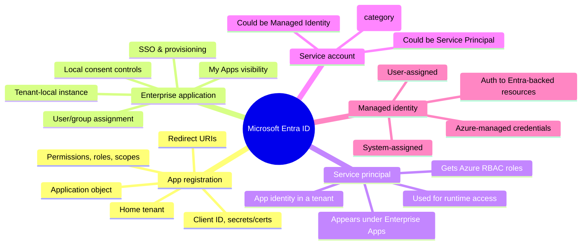
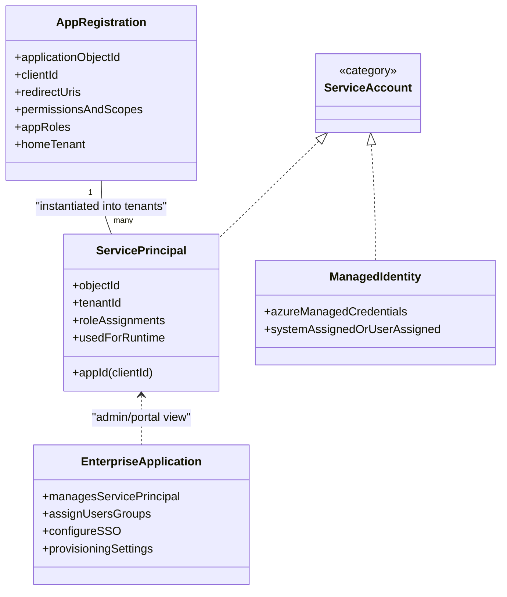
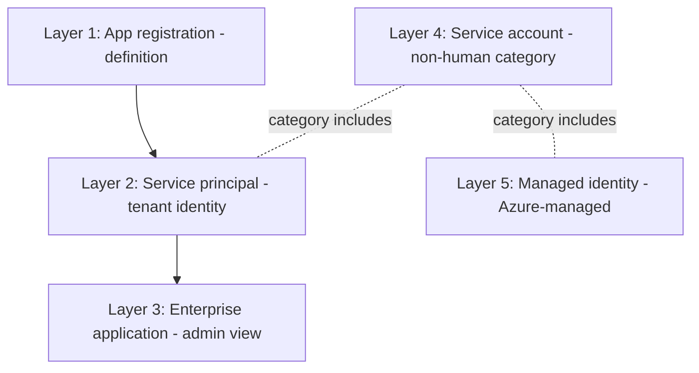
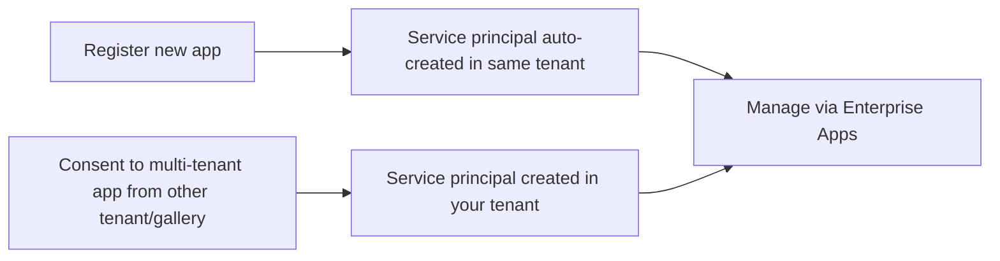
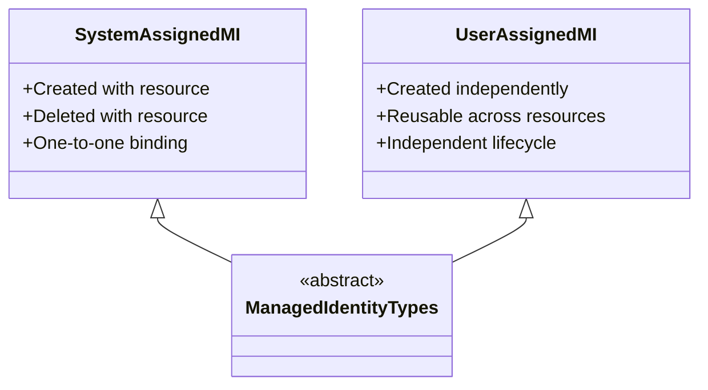
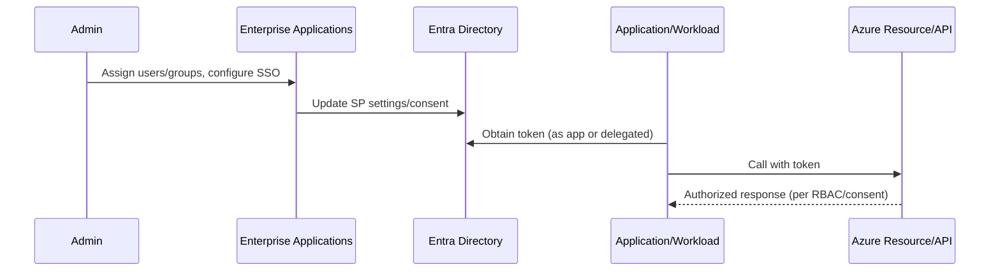
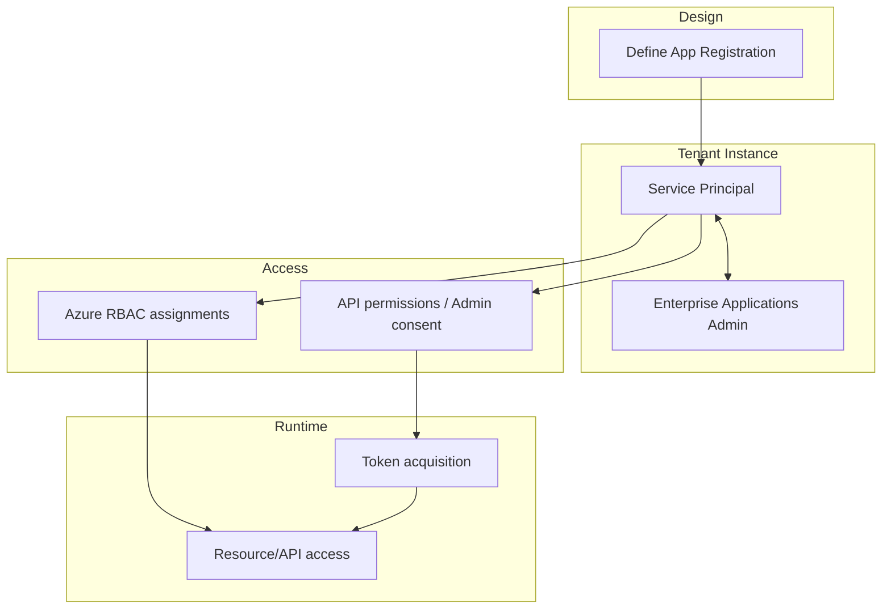

## Azure identity concepts — Mermaid diagram set

Below are multiple Mermaid diagrams explaining the relationships and flows between app registration, enterprise application, service principal, service account, and managed identity, based on `identity.txt`.

### 1) Big-picture mind map



### 2) Core object relationships (class diagram style)



### 3) Custom application flow (from registration to runtime)

```mermaid
flowchart LR
  A[Create App Registration (home tenant)] --> B[Service Principal auto-created]
  B --> C[Enterprise Applications portal manages SP]
  C --> D[Assign users/groups, configure SSO/consent]
  B --> E[Grant API permissions or Azure RBAC roles]
  E --> F[Runtime: App uses SP identity for access]
```

### 4) Third-party SaaS/gallery app adoption

```mermaid
flowchart LR
  S[Gallery / Third-party App (external blueprint)] --> T[Service Principal in your tenant]
  T --> U[Enterprise Applications admin experience]
  U --> V[Assign users/groups, SSO, provisioning, visibility]
  T --> W[Local access decisions (API/consent/RBAC)]
```

### 5) Managed identity model (Azure-managed credentials)

```mermaid
flowchart TB
  R[Azure Resource (App Service/VM/Function/etc.)] --> MI[Enable Managed Identity]
  MI -->|System-assigned| SA[(Identity tied to resource lifecycle)]
  MI -->|User-assigned| UA[(Reusable identity attached to resources)]
  SA --> AUTH[Authenticate to Entra-backed resources without handling secrets]
  UA --> AUTH
```

### 6) “When to use which?” decision helper

```mermaid
flowchart TB
  Q{Are you defining your own app's identity and auth settings?}
  Q -->|Yes| AR[Use App Registration]
  Q -->|No| Q2{Enable local management of existing app in tenant?}
  Q2 -->|Yes| EA[Use Enterprise Applications (tenant-local mgmt)]
  Q2 -->|No| Q3{Is this a workload identity (not human)?}
  Q3 -->|Yes| Q4{Runs on Azure resource with Entra-backed targets?}
  Q4 -->|Yes| MI[Use Managed Identity]
  Q4 -->|No| SP[Use Service Principal]
  Q3 -->|No| HU[Human user identity (out of scope)]
```

### 7) Layered mental model (stack)



### 8) Common misunderstandings (contrast diagram)

```mermaid
flowchart LR
  classDef note fill:#fff5b1,stroke:#d4b106,color:#333;
  A1[App registration (blueprint)] -. related but not same .- A2[Enterprise application (tenant admin view)]
  N1[Registration = definition]:::note
  N2[Enterprise app manages SP in-tenant]:::note
  A1 -.-> N1
  A2 -.-> N2

  B1[Service principal] --- A2
  N3[Enterprise application is the admin experience around the SP]:::note
  B1 -.-> N3

  C1[Service account] ---|broad term| C2[Service principal]
  C1 ---|broad term| C3[Managed identity]
```

### 9) Permissions and access contexts

```mermaid
flowchart LR
  subgraph Entra
    AR1[App Registration]
    SP1[Service Principal (tenant identity)]
    EA1[Enterprise Apps (admin view)]
    AR1 --> SP1
    SP1 <--> EA1
  end

  subgraph Azure
    RES[Azure Resource]
    ROLE[RBAC Role Assignment]
  end

  SP1 -- assigned --> ROLE
  ROLE -- grants access to --> RES
```

### 10) Delegated vs application permissions (high-level)

```mermaid
flowchart TB
  D[Delegated permissions (user present)] -->|consent| API1[Target API]
  D -->|access token includes user| OUT1[Access as user]

  A[Application permissions (no user)] -->|admin consent| API2[Target API]
  A -->|access token as app| OUT2[Daemon/automation access]
```

### 11) Service principal creation pathways



### 12) Managed identity types side-by-side



### 13) Admin touchpoints vs runtime



### 14) Full lifecycle overview



### 15) “Which identity is it?” quick categorization

```mermaid
flowchart LR
  SCAT[Service account (category)] --> SPN[Service principal (specific Entra object)]
  SCAT --> MI1[Managed identity (Azure-managed)]
  classDef note fill:#fff5b1,stroke:#d4b106,color:#333;
  NOTE1[Category label only; not a single object type.]:::note
  SCAT -.-> NOTE1
```

