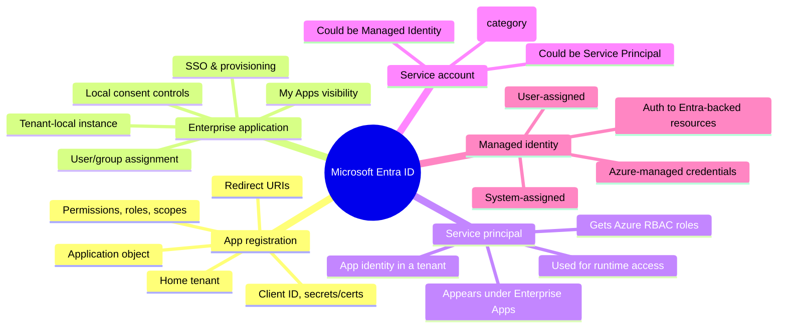
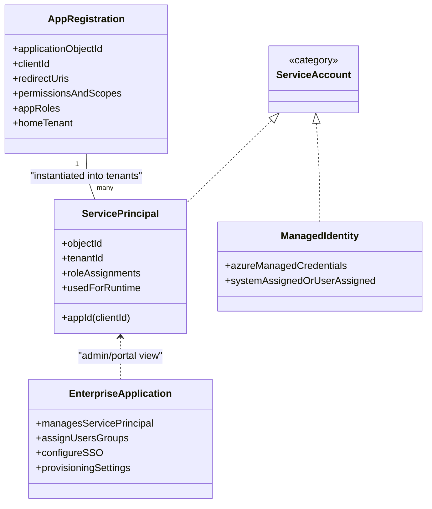
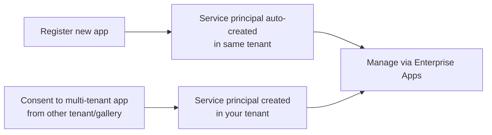
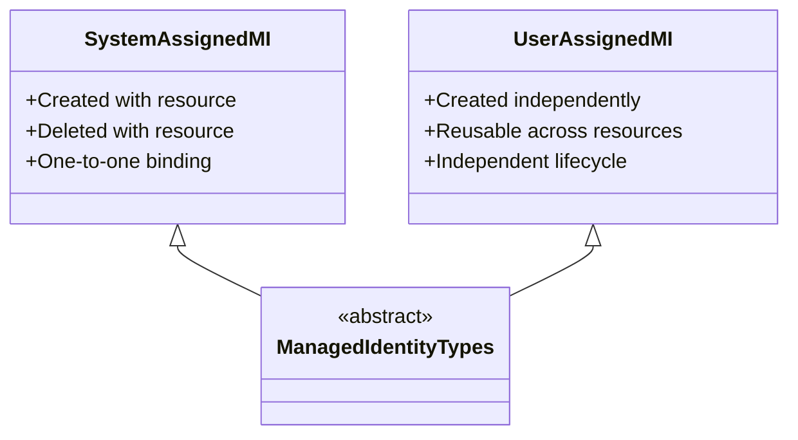
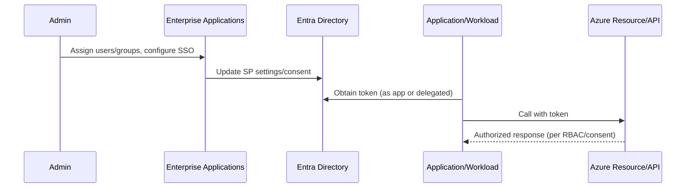
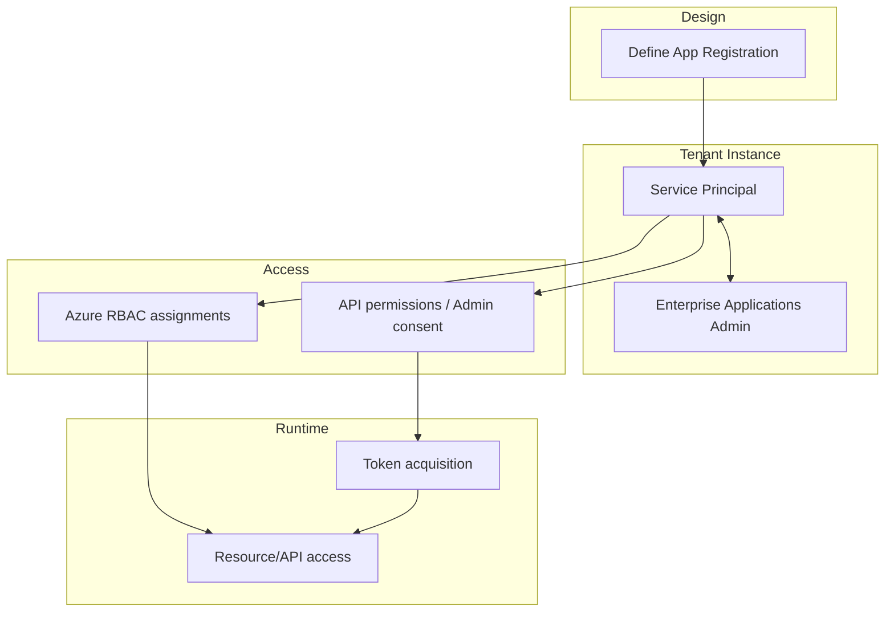

## Azure identity concepts — Mermaid diagram set

Below are multiple Mermaid diagrams explaining the relationships and flows between app registration, enterprise application, service principal, service account, and managed identity, based on `identity.txt`.

### 1) Big-picture mind map



### 2) Core object relationships (class diagram style)



### 3) Custom application flow (from registration to runtime)

```mermaid
flowchart LR
  A[Create App Registration\n(app object in home tenant)] --> B[Service Principal auto-created\nin that tenant]
  B --> C[Enterprise Applications portal\nmanages that SP]
  C --> D[Assign users/groups\nConfigure SSO/consent]
  B --> E[Grant API permissions\nor Azure RBAC roles]
  E --> F[Runtime: App uses SP identity\nfor API/resource access]
```

### 4) Third-party SaaS/gallery app adoption

```mermaid
flowchart LR
  S[Gallery / Third-party App\n(blueprint elsewhere)] --> T[Service Principal in your tenant]
  T --> U[Enterprise Applications\nadmin experience]
  U --> V[Assign users/groups,\nSSO, provisioning, visibility]
  T --> W[Local access decisions\n(API/consent/RBAC)]
```

### 5) Managed identity model (Azure-managed credentials)

```mermaid
flowchart TB
  R[Azure Resource\n(App Service/VM/Function/etc.)] --> MI[Enable Managed Identity]
  MI -->|System-assigned| SA[(Identity tied to resource lifecycle)]
  MI -->|User-assigned| UA[(Reusable identity attached to resources)]
  SA --> AUTH[Authenticate to Entra-backed resources\nwithout handling secrets]
  UA --> AUTH
```

### 6) “When to use which?” decision helper

```mermaid
flowchart TB
  Q{Are you defining your own app's\nidentity & auth settings?}
  Q -->|Yes| AR[Use App Registration]
  Q -->|No| Q2{Are you enabling local mgmt\nof an existing app in tenant?}
  Q2 -->|Yes| EA[Use Enterprise Applications\n(tenant-local mgmt)]
  Q2 -->|No| Q3{Is this a workload identity\n(not human)?}
  Q3 -->|Yes| Q4{Runs on Azure resource\nwith Entra-backed targets?}
  Q4 -->|Yes| MI[Use Managed Identity]
  Q4 -->|No| SP[Use Service Principal]
  Q3 -->|No| HU[Human user identity\n(out of scope here)]
```

### 7) Layered mental model (stack)

```mermaid
flowchart TB
  L1[Layer 1: App registration\nDesign/definition (blueprint)]
  L2[Layer 2: Service principal\nTenant-local identity]
  L3[Layer 3: Enterprise application\nAdmin/portal view for SP]
  L4[Layer 4: Service account\nNon-human identity category]
  L5[Layer 5: Managed identity\nAzure-native, secretless variant]

  L1 --> L2 --> L3
  L4 -. category includes .- L2
  L4 -. category includes .- L5
```

### 8) Common misunderstandings (contrast diagram)

```mermaid
flowchart LR
  A1[App registration\n(blueprint)] ---X--- A2[Enterprise application\n(tenant admin view)]
  note right of A1
    Not the same object.
    Registration = definition.
  end
  note left of A2
    Enterprise app is how you
    manage the SP in-tenant.
  end

  B1[Service principal] --- A2
  note bottom of B1
    Enterprise application is the
    admin experience around the SP.
  end

  C1[Service account] ---|broad term| C2[Service principal]
  C1 ---|broad term| C3[Managed identity]
```

### 9) Permissions and access contexts

```mermaid
flowchart LR
  subgraph Entra
    AR1[App Registration]
    SP1[Service Principal\n(tenant identity)]
    EA1[Enterprise Apps\n(admin view)]
    AR1 --> SP1
    SP1 <--> EA1
  end

  subgraph Azure
    RES[Azure Resource]
    ROLE[RBAC Role Assignment]
  end

  SP1 -- assigned --> ROLE
  ROLE -- grants access to --> RES
```

### 10) Delegated vs application permissions (high-level)

```mermaid
flowchart TB
  D[Delegated permissions\n(User present)] -->|consent| API1[Target API]
  D -->|access token includes user| OUT1[Access as user]

  A[Application permissions\n(No user)] -->|admin consent| API2[Target API]
  A -->|access token as app| OUT2[Daemon/automation access]
```

### 11) Service principal creation pathways



### 12) Managed identity types side-by-side



### 13) Admin touchpoints vs runtime



### 14) Full lifecycle overview



### 15) “Which identity is it?” quick categorization

```mermaid
flowchart LR
  SCAT[Service account (category)] --> SPN[Service principal (specific Entra object)]
  SCAT --> MI1[Managed identity (Azure-managed)]
  note bottom of SCAT
    Category label only,
    not a single object type.
  end
```

