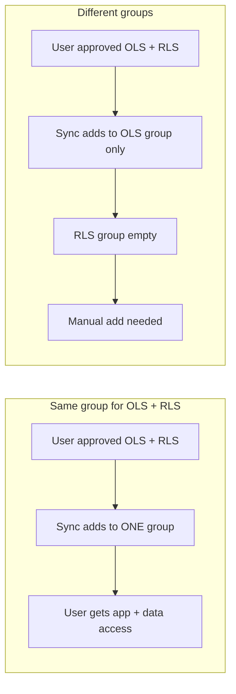
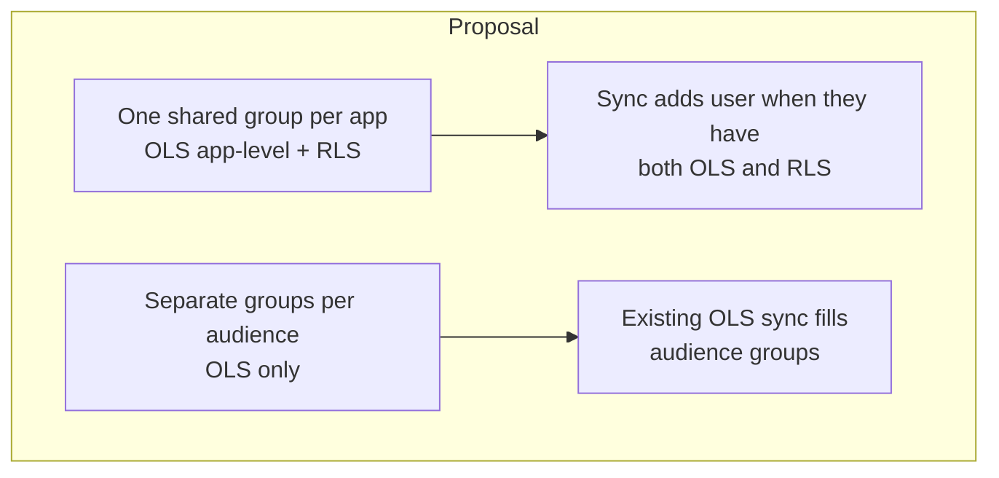
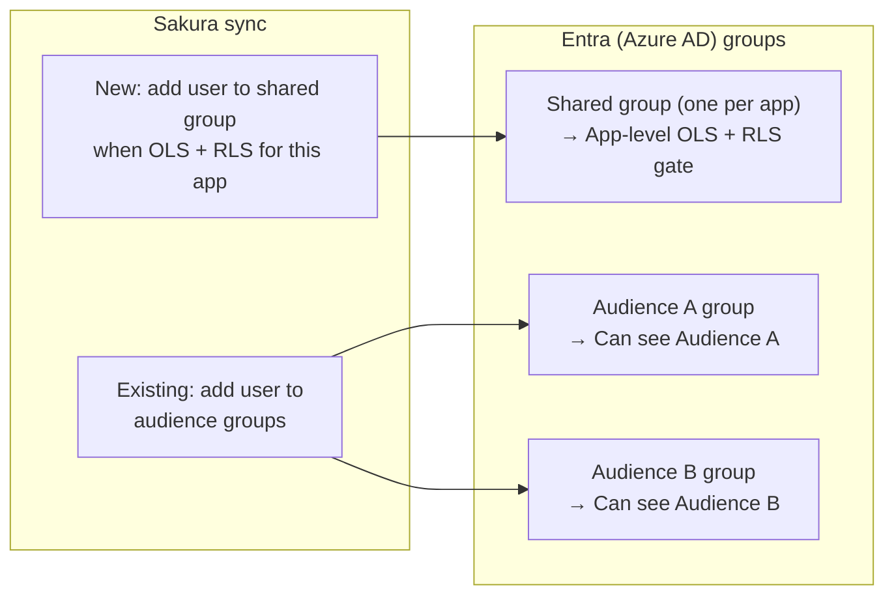
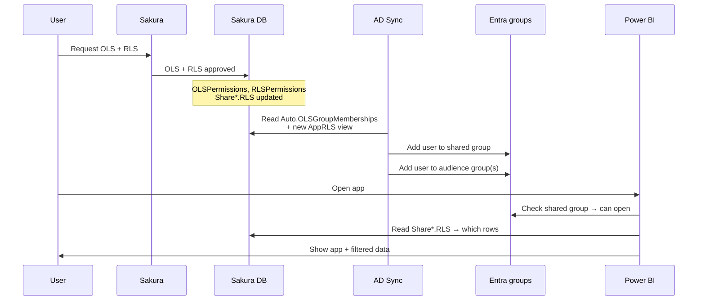
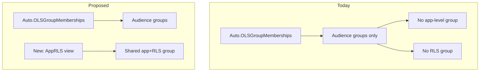
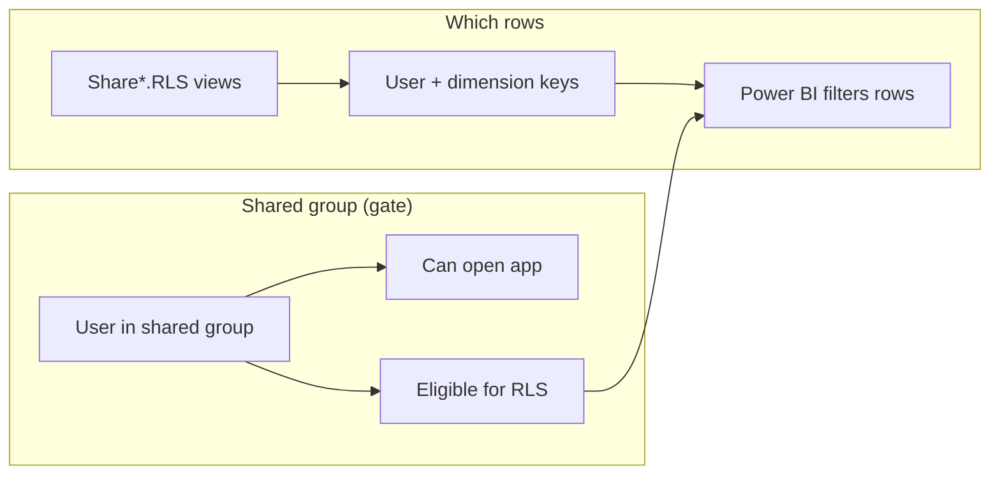

# One AD Group for OLS App-Level + RLS — Proposal (Mermaid)

This document explains the proposal using Mermaid diagrams: **one** AD group for both OLS (app-level) and RLS, plus **separate** groups per audience handled by the existing OLS AD sync.

---

## 1. The problem

When the **same** AD group is used for OLS and RLS, sync adds the user once → they get both. When **different** groups are used for RLS, that RLS group is never filled by Sakura → someone must add the user manually.

---

## 2. The proposal in one picture

- **One AD group** = OLS (app-level) **and** RLS → sync fills it when user has both; no manual “add to RLS group.”
- **Different groups per audience** = OLS only → existing OLS AD sync fills them.

---

## 3. Group layout

---

## 4. End-to-end flow (user gets both OLS and RLS)

---

## 5. What sync fills today vs proposed

---

## 6. RLS: still from Share*.RLS (no group per dimension)

The shared group is only a **gate** (“has RLS for this app”). Which rows the user sees still comes from **Share*.RLS** — no extra AD group per dimension.

---

## 7. Summary

| Item | Description |
|------|-------------|
| **Shared group** | One per app: app-level OLS + “has RLS.” Sync fills when user has both OLS and RLS. |
| **Audience groups** | One per audience: OLS only. Existing sync fills from `Auto.OLSGroupMemberships`. |
| **RLS row filter** | Still **Share*.RLS** (user + dimension keys). No AD group per dimension. |
| **Upside** | No manual add to a separate “RLS group”; one sync covers shared + audience groups. |

---

*See also: `OLS-RLS-Use-Cases-And-Diagrams.md`, `OLS_RLS_ORIGINAL_VS_PROPOSED_QA.md`.*
