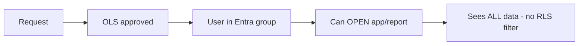
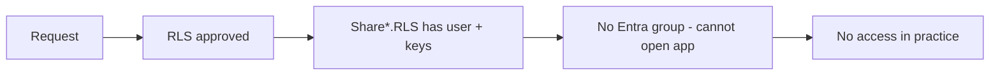
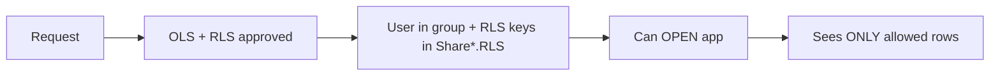
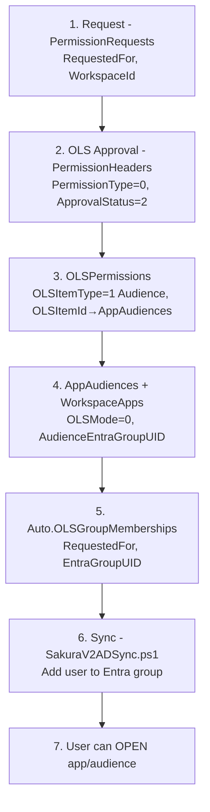
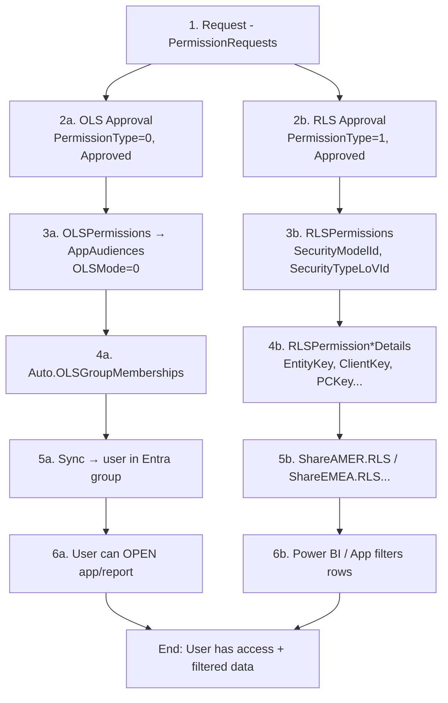
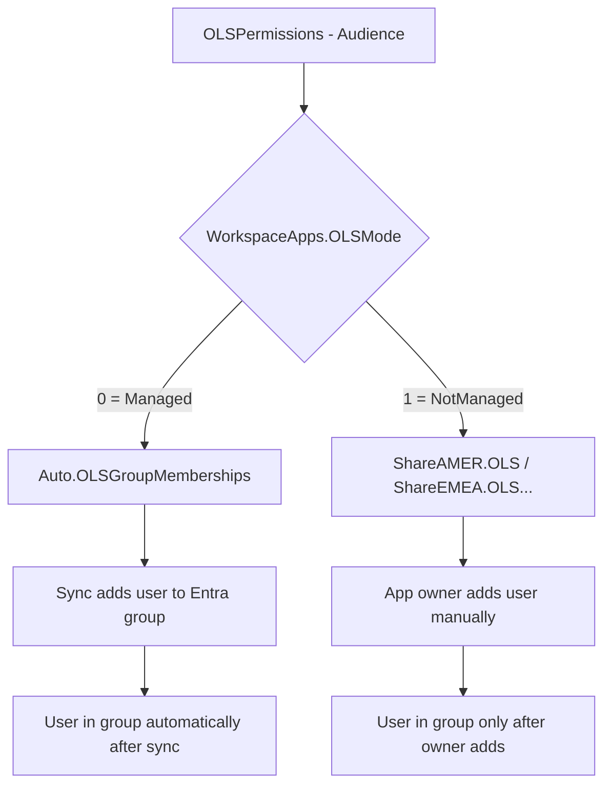
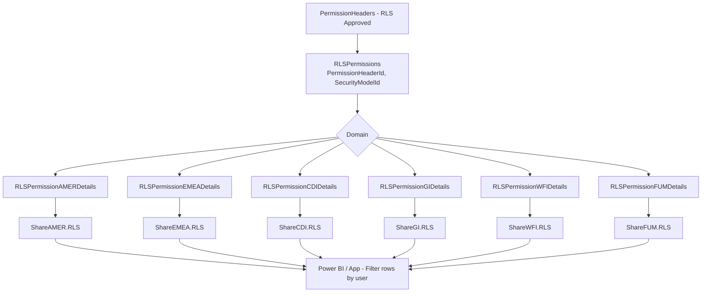
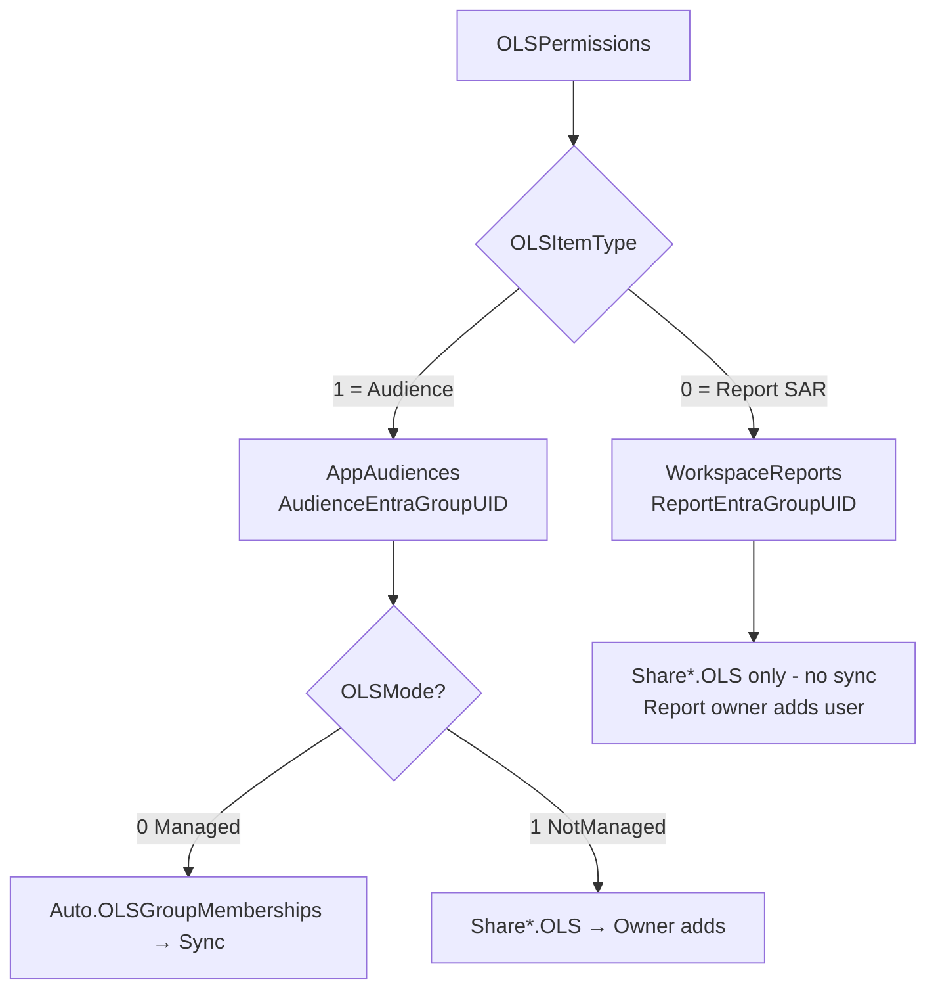
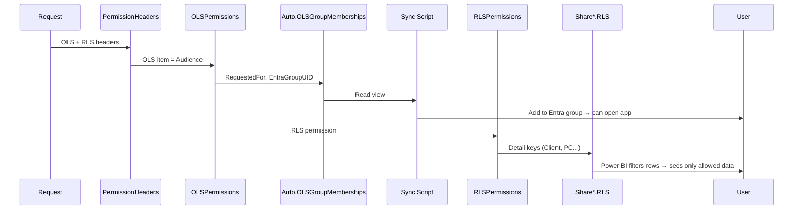

# OLS and RLS Use Cases and Diagrams

This document describes how **OLS** (Object-Level Security) and **RLS** (Row-Level Security) work in Sakura, with Mermaid diagrams for each use case.

---

## 1. What OLS and RLS Give

| | OLS | RLS |
|---|-----|-----|
| **What the request gives** | Access to the **object** (app, audience, or report) | Access to **data** (which rows the user can see) |
| **Meaning** | "Can they open it?" | "What rows can they see inside it?" |

- **OLS** = which apps/audiences/reports the user can open.
- **RLS** = which rows (Entity, Client, PC, etc.) the user sees inside the dataset.

---

## 2. Use Case: OLS Only (No RLS)

**What’s approved:** OLS only. No RLS permission.

**Result:** User can open the app/report and sees **all data** in that object (no row filter).

---

## 3. Use Case: RLS Only (No OLS)

**What’s approved:** RLS only. No OLS (no audience/report/Entra group).

**Result:** User has a row filter defined but **cannot open** the app/report (no group membership). RLS is useless until they also get OLS.

---

## 4. Use Case: Both OLS and RLS

**What’s approved:** OLS (access to app/report) and RLS (which rows they can see).

**Result:** User can open the app and sees **only** the rows allowed by RLS.

---

## 5. Summary: All Three Cases

```mermaid
flowchart TB
    subgraph OLS_only["OLS only"]
        O1[Request] --> O2[OLS approved]
        O2 --> O3[User in group]
        O3 --> O4[Can open app - Sees ALL data]
    end

    subgraph RLS_only["RLS only"]
        R1[Request] --> R2[RLS approved]
        R2 --> R3[Share*.RLS has keys]
        R3 --> R4[Cannot open app - No OLS]
    end

    subgraph Both["Both OLS + RLS"]
        B1[Request] --> B2[OLS + RLS approved]
        B2 --> B3[User in group + RLS keys]
        B3 --> B4[Can open app - Sees ONLY allowed rows]
    end
```

| Case | Can open app/report? | What data they see |
|------|----------------------|---------------------|
| **OLS only** | Yes | All data (no RLS filter) |
| **RLS only** | No | Nothing (can't open it) |
| **Both** | Yes | Only rows allowed by RLS |

---

## 6. Managed OLS Only — End-to-End

Full flow from request to user in Entra group (managed apps only, OLSMode = 0).

---

## 7. Managed OLS + RLS — End-to-End (Both Branches)

One request with both OLS and RLS; managed OLS path + RLS path to filtered data.

---

## 8. Managed vs Not Managed OLS (Split)

Where the OLS path splits: managed (sync) vs not managed (app owner).

---

## 9. RLS Flow — Per Domain

RLS is stored per domain in detail tables and exposed via Share schema views.

---

## 10. OLS Item Types (Audience vs Report)

OLS can point to an **audience** (app) or a **standalone report** (SAR). Only audiences with OLSMode=0 feed the managed sync.

---

## 11. Sequence: Managed OLS + RLS (One User)

---

## Reference: Key Tables and Views

| Purpose | Table / View |
|--------|---------------|
| Request | `dbo.PermissionRequests` |
| OLS/RLS approval | `dbo.PermissionHeaders` (PermissionType 0=OLS, 1=RLS) |
| OLS item | `dbo.OLSPermissions` → AppAudiences or WorkspaceReports |
| RLS permission | `dbo.RLSPermissions` → `dbo.RLSPermission*Details` (per domain) |
| Managed OLS sync source | `Auto.OLSGroupMemberships` |
| Not-managed OLS (owner view) | `ShareAMER.OLS`, `ShareEMEA.OLS`, ... |
| RLS (per domain) | `ShareAMER.RLS`, `ShareEMEA.RLS`, ... |
