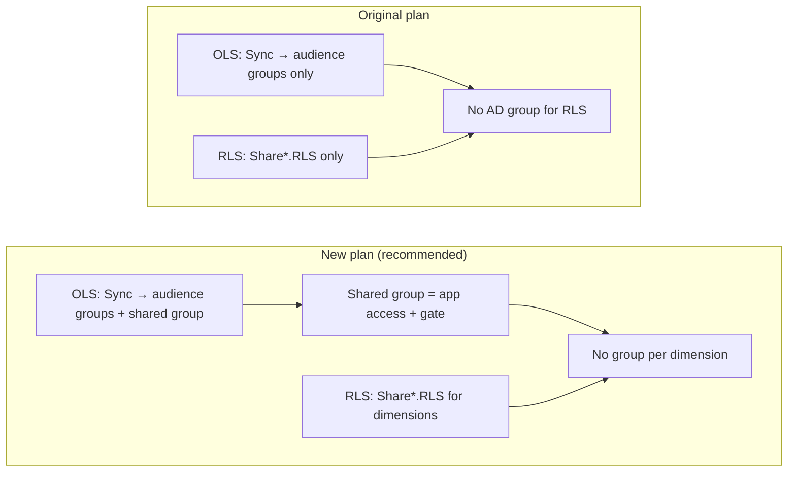

# Original Plan vs Proposed Plan: OLS and RLS — Q&A (50 Questions)

This document answers common questions about the **original** Sakura V2 plan (managed OLS via AD sync, RLS via Share* views only) and the **proposed** plan (one shared AD group per app for app access + gate, with Share*.RLS still defining row-level scope). It clarifies that **no Azure security group per dimension** is required in either approach; dimensions are always driven by Share*.RLS in the recommended design.

---

## Clarification up front: Do we need a group per dimension?

**No.** In both the original plan and the recommended form of the new plan:

- **RLS dimension scope** (which Entity, Client, Service Line, etc. a user sees) comes from **Share*.RLS views** (or tables built from them). Power BI filters rows by **user identity + dimension keys** from the view. There is **no** “group per dimension” or “group per security type” in the standard design.
- **AD groups** are used only for **OLS**: which audience(s) the user can open (per-audience groups, one per audience) and, in the proposal, optionally **one shared group per app** as a gate (“can open app” + “has RLS access”). So: **one shared group per app** (proposal) + **one group per audience** (existing), not per dimension.

If someone said “for every dimension group, a new Azure security group is required,” that would describe a **different** (group-based RLS) design. That is **not** the original plan and **not** the recommended new plan; both keep dimensions in Share*.RLS.

---

## Part 1: The two plans in short

### Q1. What is the “original plan” for OLS and RLS in Sakura V2?

**Original plan:**  
- **OLS (managed apps):** Sakura sync (`SakuraV2ADSync.ps1`) reads `Auto.OLSGroupMemberships` and adds/removes users in **Entra (Azure AD) groups** — one group per **audience** (`AudienceEntraGroupUID`). So: managed OLS = AD sync to audience-level groups only.  
- **RLS:** Stored in `RLSPermissions` and domain detail tables; exposed via **Share*.RLS** views (e.g. ShareAMER.RLS, ShareEMEA.RLS). Power BI (or Fabric) reads these views (or tables built from them) and filters rows by **user + dimension keys**. **No AD group is used for RLS**; the view is the source of truth for “which rows this user sees.”

### Q2. What is the “new plan” (the proposal)?

**New plan (proposal):**  
- Keep everything above, and **add**: one **shared** Entra group **per app** (or per workspace) used for (a) **app-level OLS** (“can open this app”) and (b) a **gate** meaning “this user has RLS access for this app.”  
- Sync is extended to add/remove users in this shared group when they have **both** approved OLS (to at least one audience in that app) and approved RLS for that workspace/domain.  
- **RLS dimension scope** still comes from **Share*.RLS** (recommended). So we do **not** introduce “one group per dimension”; we introduce **one group per app** as a gate.

### Q3. Why was the original plan considered sensible?

Because it cleanly separates concerns:  
- **OLS** = “can open this object” → enforced by **AD group membership** (sync script).  
- **RLS** = “which rows can they see?” → enforced by **view access** (Share*.RLS). No AD groups for RLS, so no sync dependency for row-level scope; approval in Sakura immediately reflects in the view, and Power BI uses the view. Fewer groups, no “RLS group” to keep in sync, and dimensions stay flexible (per user, per security type, per domain) in the database, not in AD.

### Q4. Why is the new plan being considered?

To address a **specific** scenario: when the downstream (e.g. Power BI) uses a **different** AD group for “RLS” than for “OLS,” that RLS group is never filled by Sakura, so someone must **manually** add users to the RLS group for data access. The proposal adds **one shared group per app** so that a single sync add gives “app access + eligible for RLS,” avoiding a separate manual “add to RLS group” step, while still keeping **Share*.RLS** as the source of truth for which rows they see (so no group per dimension).

---

## Part 2: What — definitions and scope

### Q5. In the original plan, how many kinds of AD groups are there?

**One kind:** **Audience-level** groups (and for SAR, report-level — but those are NotManaged, so sync doesn’t touch them). One group per audience; sync adds users to the audience groups they are approved for. There is **no** “app-level” or “RLS” group in the original plan.

### Q6. In the new plan, how many kinds of AD groups are there?

**Two kinds:**  
1. **Shared group (one per app):** app-level OLS + “has RLS” gate.  
2. **Audience groups (unchanged):** one per audience; same as original.  
There are **no** “dimension groups” or “groups per security type” in the recommended new plan.

### Q7. What is “Share*.RLS” and who consumes it?

Share*.RLS are **database views** (e.g. ShareAMER.RLS, ShareEMEA.RLS) that expose approved RLS: **user identifier + dimension keys** (EntityKey, ClientKey, SecurityType, etc.) per domain. Power BI, Fabric, or an ETL pipeline reads these views (or tables built from them) and applies row filters. In both original and recommended new plan, **Share*.RLS is the source of truth for row-level scope**.

### Q8. Does the original plan use any AD group for RLS?

**No.** RLS is entirely view-driven. No sync script adds users to any “RLS group”; Power BI gets row scope from Share*.RLS (or downstream tables built from it).

### Q9. Does the new plan use an AD group to define “which dimension values” a user sees?

**No**, in the **recommended** form. The shared group is only a **gate** (“user is allowed RLS for this app”). **Which rows** they see still comes from **Share*.RLS** (user + dimension keys). So we do **not** need “a new Azure security group for every dimension.”

### Q10. What is “Auto.OLSGroupMemberships”?

A **view** in the Sakura database that returns the desired **(RequestedFor, EntraGroupUID)** for **managed OLS**: one row per (user, audience group). The sync script reads this view and makes Entra membership match. It only contains **audience** (and optionally report) groups, not “app+RLS” or “per-dimension” groups.

---

## Part 3: Why — reasons and trade-offs

### Q11. Why does the original plan not use AD groups for RLS?

To keep RLS flexible and avoid sync dependency: row-level scope is per user, per security type, per domain, and can change with approvals/revocations. Putting that in **views** means one source of truth (Share*.RLS), no extra AD groups to create or sync, and Power BI can refresh from the view on a schedule. Using AD groups for RLS would require either one group per user (not scalable) or one group per “scope” (e.g. per dimension combination), which would be many groups and complex to maintain.

### Q12. Why might someone think “a new Azure security group per dimension” is required?

That would be true only in a **group-based RLS** design, where each “data scope” (e.g. Entity=A, Client=B) is represented by an AD group and Power BI uses group membership to filter rows. That is **not** the original plan and **not** the recommended new plan; both use Share*.RLS for dimensions. So “per dimension group” is a misunderstanding of our design.

### Q13. Why add a “shared group” in the new plan?

To close the gap when the downstream expects **one** group that means “can open app and has data access.” If that group is filled by Sakura (when user has both OLS and RLS approval), we avoid a **manual** “add to RLS group” step. The shared group is a **convenience** for app access + gate, not a replacement for Share*.RLS for dimensions.

### Q14. Why keep Share*.RLS for dimensions in the new plan?

So we don’t break the original design: **one** source of truth for row-level scope (the view), no explosion of AD groups per dimension or per scope, and approvals/revocations still take effect via the view without waiting for sync. The shared group only answers “is this user allowed to have RLS for this app?”; the view answers “which rows?”

### Q15. What happens if we use the shared group as the RLS role (group = data scope)?

Then Power BI would use **group membership** to decide row access, and **Share*.RLS would be bypassed** for that app. That would break the original view-based RLS plan and require either many groups (e.g. per dimension combination) or a single “all data” group — both undesirable. So the **recommended** approach is: shared group = gate only; Share*.RLS = row filter.

---

## Part 4: How — mechanics

### Q16. In the original plan, how does a user get “can open the app”?

They are approved for OLS to an **audience** in that app. The sync script reads `Auto.OLSGroupMemberships`, sees (user, audience group), and adds them to that audience’s Entra group. Power BI is configured so that membership in that audience group grants access to open the app (or that audience’s content).

### Q17. In the original plan, how does a user get “which rows they see”?

From **Share*.RLS**. When their RLS is approved, a row appears in the relevant domain view (e.g. ShareEMEA.RLS) with their user id and dimension keys. Power BI (or the pipeline) reads the view and filters rows by that. No AD group is involved for row scope.

### Q18. In the new plan, how does the user get into the “shared” group?

We add a **new view** (e.g. `Auto.AppRLSGroupMemberships`) that lists (RequestedFor, EntraGroupUID) for the shared group when the user has **both** (a) approved OLS to at least one audience in that app, and (b) approved RLS for that workspace/domain. The sync script is extended to read this view and add/remove users in the shared group the same way it does for audience groups.

### Q19. In the new plan, how do we know “which rows” the user sees?

**Same as original:** from **Share*.RLS**. The shared group does **not** define dimension scope; it only signals “has RLS access.” Power BI still reads the view and filters by user + dimension keys.

### Q20. Does the sync script in the original plan touch RLS?

**No.** It only reads `Auto.OLSGroupMemberships` (audience groups). RLS is entirely in the DB and views; no sync for RLS.

### Q21. Does the sync script in the new plan touch “dimension” or “RLS” groups?

**No.** In the recommended design, the sync only adds users to (1) **audience groups** (existing) and (2) the **shared app+RLS gate group** (new). There are no “RLS dimension groups” or “per-dimension” groups to sync.

### Q22. Where is the “shared group” GUID stored in the new plan?

In the database, e.g. on `WorkspaceApps` (e.g. reuse or repurpose `AppEntraGroupUID`) or on Workspaces if the group is per workspace. The new view that drives sync joins to this so it knows which EntraGroupUID to use for “app+RLS” for that app.

### Q23. How many new AD groups does the new plan introduce per app?

**One:** the shared “app + RLS gate” group. Audience groups already exist. So total groups = 1 shared + N audiences per app, not “per dimension.”

### Q24. How many new AD groups does the new plan introduce per dimension or per security type?

**Zero.** Dimensions and security types stay in Share*.RLS; we do not create groups per dimension or per security type.

---

## Part 5: Comparison table (original vs new)

### Q25. Summary: Original plan — OLS

**OLS:** AD sync to **audience-level** groups only (`Auto.OLSGroupMemberships` → `AudienceEntraGroupUID`). Managed apps only; NotManaged/SAR excluded from sync.

### Q26. Summary: Original plan — RLS

**RLS:** Share*.RLS views only. Power BI (or pipeline) reads view; filters rows by user + dimension keys. **No AD group for RLS.**

### Q27. Summary: New plan — OLS

**OLS:** Same as original **plus** one **shared group per app** for “can open app” (and “has RLS” gate). Sync fills both shared group and audience groups.

### Q28. Summary: New plan — RLS

**RLS (recommended):** **Unchanged** from original. Share*.RLS remains source of truth for row scope. Shared group = gate only; **no group per dimension.**

### Q29. Do we need a new Azure security group for every dimension in the original plan?

**No.** RLS dimensions are in Share*.RLS only; no dimension-based groups.

### Q30. Do we need a new Azure security group for every dimension in the new plan?

**No.** Same as original; dimensions stay in Share*.RLS. The new plan adds only **one shared group per app**, not per dimension.

### Q31. What problem does the original plan have that the new plan addresses?

When the **downstream** (e.g. Power BI) is set up so that “RLS” is granted via a **different** AD group than the OLS audience groups, that RLS group is never filled by Sakura → manual add required. The new plan provides **one** group (shared) that Sakura fills when the user has both OLS and RLS, so no separate “RLS group” needs manual population — while still using Share*.RLS for actual row scope.

### Q32. What stays the same between original and new plan?

- RLS storage: `RLSPermissions` + domain detail tables.  
- Share*.RLS views and their role as source of truth for **which rows** a user sees.  
- Audience-level OLS: sync still fills audience groups from `Auto.OLSGroupMemberships`.  
- No AD groups for dimension scope in either plan.

---

## Part 6: Architecture and implementation

### Q33. What database changes does the original plan require?

None beyond what already exists: `Auto.OLSGroupMemberships`, `OLSPermissions`, `RLSPermissions`, domain detail tables, and Share*.RLS views.

### Q34. What database changes does the new plan require?

(1) Store the shared group GUID (e.g. on `WorkspaceApps` or Workspaces).  
(2) A new view (e.g. `Auto.AppRLSGroupMemberships`) returning (RequestedFor, EntraGroupUID, LastChangeDate) for the shared group when the user has both OLS (to an audience in that app) and RLS (for that workspace/domain).

### Q35. What sync script changes does the new plan require?

Extend `SakuraV2ADSync.ps1` to **also** read the new view (e.g. `Auto.AppRLSGroupMemberships`) and merge its (user, group) rows into the desired membership set, then run the same diff/add/remove logic. So one script, two (or more) view sources; no “per dimension” logic.

### Q36. Does the new plan require Power BI to stop using Share*.RLS?

**No.** Recommended is to **keep** using Share*.RLS for row-level filter. Use the shared group only for app access and “has RLS” gate.

### Q37. Can we adopt the “shared group” but still use Share*.RLS for dimensions?

**Yes.** That is the **recommended** approach: shared group = app + gate; Share*.RLS = dimension scope. No per-dimension groups.

### Q38. If we already have “one group per dimension” in Power BI, does the new plan force us to keep that?

No. The new plan **does not** introduce “one group per dimension.” If your current setup uses many groups for RLS, that is separate from this proposal. The proposal is: one shared group per app (gate) + Share*.RLS for dimensions. You can migrate away from “group per dimension” to view-based RLS.

---

## Part 7: Who, when, and operations

### Q39. Who maintains audience groups in both plans?

Sakura sync script, reading `Auto.OLSGroupMemberships`, for **managed** apps (OLSMode = 0). App owners maintain groups for NotManaged/SAR (using Share*.OLS as reference).

### Q40. Who maintains the shared group in the new plan?

Sakura sync script, reading the new view (e.g. `Auto.AppRLSGroupMemberships`). No manual maintenance for membership.

### Q41. Who maintains RLS data (dimension keys) in both plans?

Sakura application: approvals/revocations update `RLSPermissions` and domain detail tables; Share*.RLS views reflect that. No AD group maintenance for dimensions.

### Q42. When does a user get added to the shared group in the new plan?

When they have **both** (a) at least one approved OLS permission to an audience in that app, and (b) at least one approved RLS permission for that workspace/domain. The new view encodes this; sync runs (e.g. daily) and adds them to the shared group.

### Q43. When does a user get removed from the shared group?

When they no longer have both OLS and RLS (e.g. revocation). The new view stops returning (user, shared group); on next sync run they are removed from the group.

### Q44. Does the new plan add more considerations for Power BI admins?

Slightly: they must (1) create or designate **one** Entra group per app for “app + RLS gate,” (2) give its GUID to Sakura, (3) assign that group to the app for access, and (4) **keep** using Share*.RLS for the actual row filter (not use the shared group as the RLS role that defines scope). No per-dimension group setup.

---

## Part 8: Edge cases and clarification

### Q45. What if an app has 10 audiences and 5 security types — how many groups?

**Original:** 10 audience groups (one per audience). No groups for security types.  
**New:** Same 10 audience groups **plus** 1 shared group for that app. Total 11 groups. Still **no** groups per security type or per dimension.

### Q46. What if we have 100 dimension value combinations (e.g. Entity × Client)?

In **both** plans, those combinations are in **Share*.RLS** (rows in the view), not in 100 AD groups. So no “100 groups”; one view (per domain) with many rows.

### Q47. Does “one shared group per app” mean one group per workspace?

It can be defined **per app** (e.g. on `WorkspaceApps`) or **per workspace** (e.g. on Workspaces), depending on how you want to scope “has RLS for this app.” Either way, it’s **one** group per app or per workspace, not per dimension.

### Q48. Can we stick to the original plan and never add the shared group?

**Yes.** The original plan is valid: OLS = audience groups via sync; RLS = Share*.RLS only. The new plan is an **optional** extension for environments where a single “app+RLS” group simplifies operations and avoids manual “add to RLS group” steps.

### Q49. What is the one-sentence difference between original and new plan?

**Original:** OLS = sync to audience groups; RLS = Share*.RLS only (no AD group for RLS). **New:** Same, plus one **shared group per app** that sync fills when user has both OLS and RLS, used as app access + gate, with **Share*.RLS still defining which rows** they see — so still **no group per dimension**.

### Q50. Final clarification: “For every dimension group, a new Azure security group is required” — true or false?

**False** for both the original plan and the recommended new plan. **No** Azure security group is required per dimension. Dimensions are in Share*.RLS. AD groups are only for OLS (audience-level and, in the proposal, one shared group per app as a gate). If “dimension group” meant “audience,” then we have one group **per audience**, not per dimension (Entity, Client, etc.). The document above uses “dimension” to mean RLS dimension (EntityKey, ClientKey, etc.), and for those we do **not** create new Azure security groups.

---

## Quick reference diagram

---

*End of Q&A. For diagrams and proposal details, see `OLS-RLS-Use-Cases-And-Diagrams.md`.*
