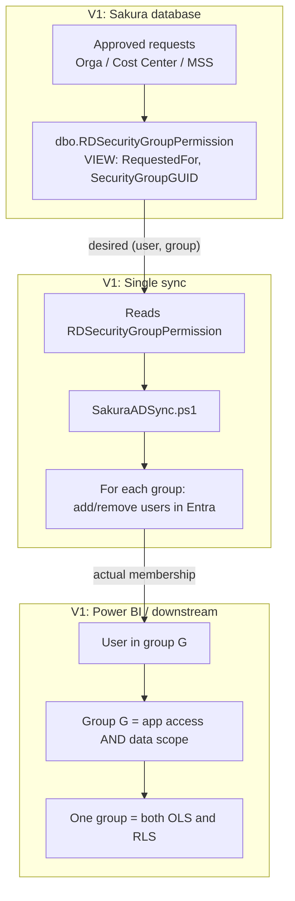
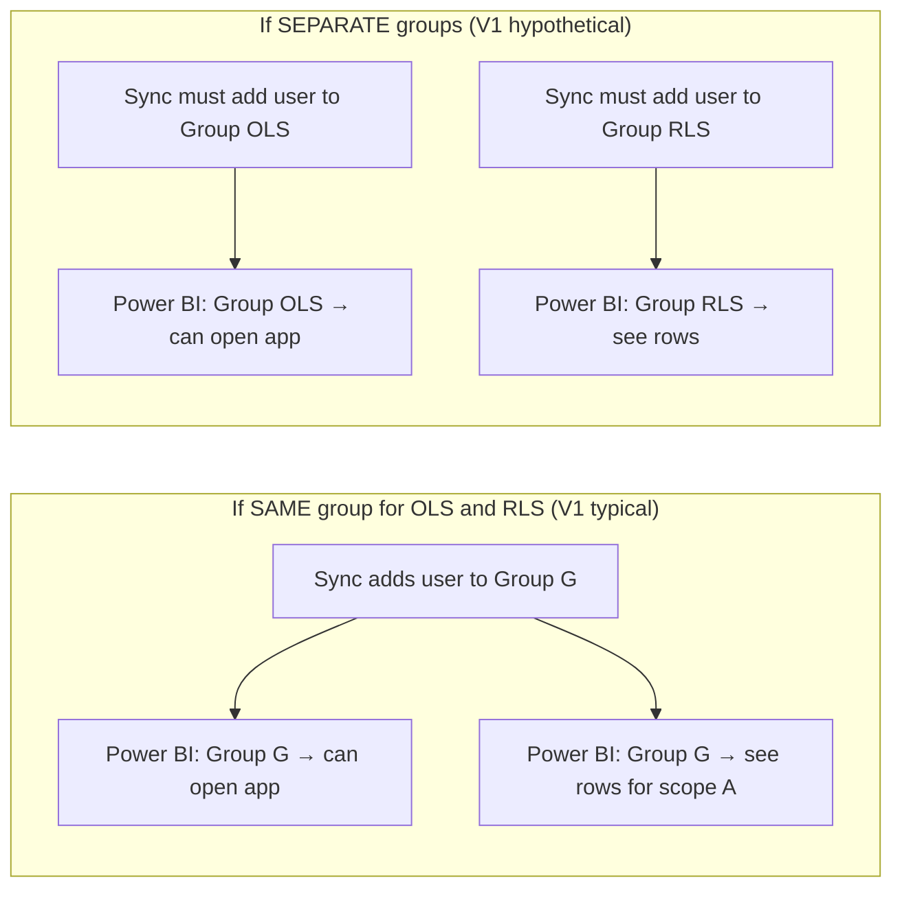
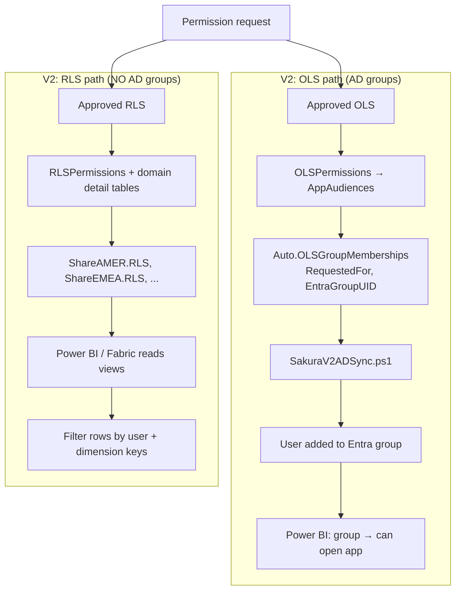
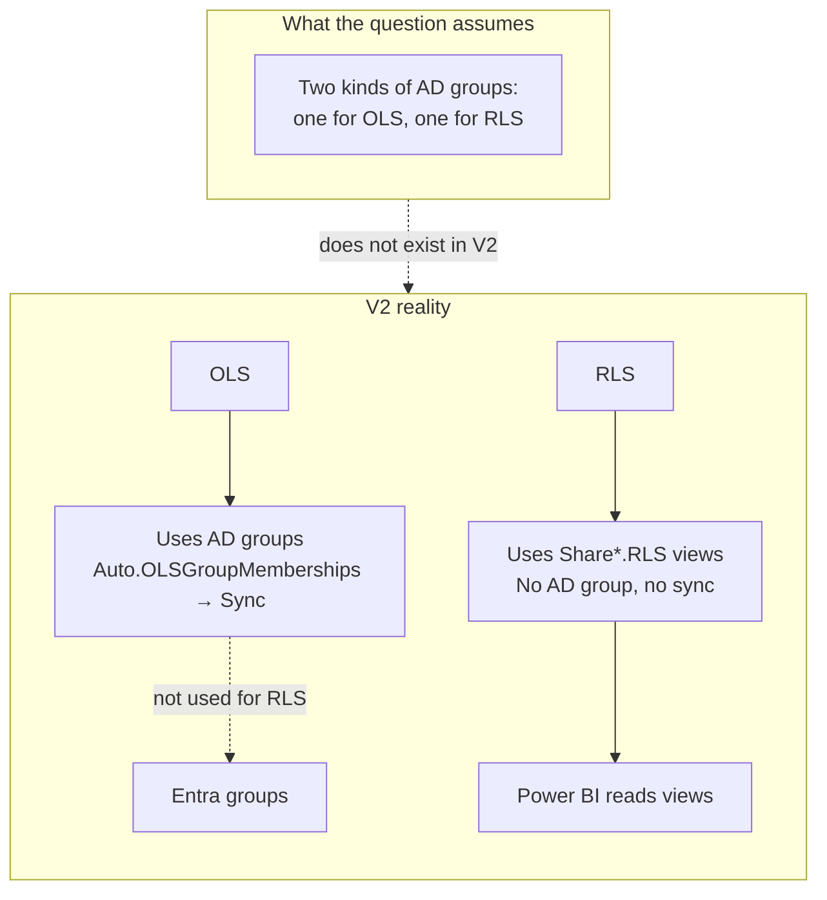
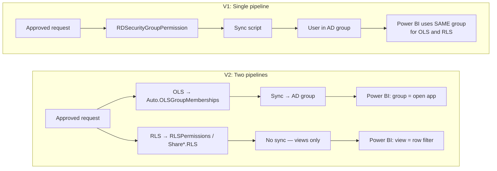

## Why “Same vs Separate AD Groups for OLS and RLS” Makes Sense in V1 but Not in V2

This section explains in detail why the question *“If we have the same AD group for OLS and RLS we have no issue; what if we have separate AD groups for OLS and RLS?”* is meaningful in **Sakura V1** but **does not apply** in **Sakura V2**.

---

### V1: One Mechanism for Both OLS and RLS (Group-Driven)

In V1, **both** “can the user open the app?” (OLS) and “which rows can they see?” (RLS) were enforced by **the same thing**: **Azure AD group membership**.

**What this means:**

1. **One view:** `RDSecurityGroupPermission` produced rows like `(RequestedFor, SecurityGroupGUID)`. That view was built from approved requests (Orga, Cost Center, MSS). There was **no separate** “OLS table” vs “RLS table” for sync — one view encoded “this user should be in this group.”
2. **One sync script:** `SakuraADSync.ps1` read that view and updated Entra so that membership matched. So **one pipeline** fed **all** security groups used for access.
3. **One meaning per group:** In Power BI (or the semantic model), **each group** effectively meant both:
   - **OLS:** “User can open this app/report” (because the app was configured to allow that group).
   - **RLS:** “User sees this data scope” (because the report’s RLS rules were written to use **group membership** — e.g. “if user is in #SG-UN-SAKURA-FIN then show rows where Entity = X”).

So in V1, **OLS and RLS were not separate pipelines** — they were **two uses of the same AD group membership**.

**Why the question makes sense in V1:**

- **Same group:** One sync run adds the user to one group; that group is used for both “can open” and “which rows.” No gap.
- **Separate groups:** You would need the sync to add the user to **both** “OLS group” and “RLS group.” If the view or script only fed one of them, the user would have app access but no data (or the reverse). So the question “what if we have separate AD groups for OLS and RLS?” is exactly about: *we must ensure both groups get the right members from the same source of truth.*

So in V1, the question is **valid and important**: it’s about whether one group carries both meanings or two groups do, and in the latter case, ensuring the **same** sync/view populates **both**.

---

### V2: Two Completely Separate Mechanisms (OLS = Groups, RLS = Views)

In V2, OLS and RLS use **different mechanisms**. Only OLS uses AD groups; RLS does **not** use AD groups at all.

**What this means:**

1. **OLS:** Stored in `OLSPermissions` (and related tables). The **only** place that drives AD group membership is `Auto.OLSGroupMemberships`. The sync script reads **only** that view and updates **only** Entra. So in V2, **only OLS** is “group-driven.”
2. **RLS:** Stored in `RLSPermissions` and domain detail tables (e.g. `RLSPermissionEMEADetails`). It is exposed to downstream via **Share*.RLS views**. Power BI (or Fabric) reads those views (or tables built from them) and applies row filters by **user identity + dimension keys**. There is **no** “RLS group” and **no** sync that adds users to an “RLS group.”
3. So in V2 there is **no** “same AD group for OLS and RLS” vs “separate AD groups for OLS and RLS” — because **RLS does not use any AD group** in the design.

**Why the question does not apply in V2:**

- There is **no** “RLS AD group” maintained by Sakura. The sync script does **not** add users to any group for RLS.
- So you **cannot** have “the same AD group for OLS and RLS” in the V2 sense — OLS has groups, RLS has views.
- You also **cannot** have “separate AD groups for OLS and RLS” in the V2 design — there is only one set of groups (OLS), and RLS is handled entirely outside the group/sync pipeline.

The question implicitly assumes **both** OLS and RLS are enforced via AD groups (same or different). That is true in V1; it is **false** in V2 for RLS.

---

### Side-by-Side Summary (Mermaid)

| | V1 | V2 |
|---|----|----|
| **OLS** | AD group (from RDSecurityGroupPermission) | AD group (from Auto.OLSGroupMemberships + sync) |
| **RLS** | **Same AD group** (group membership = data scope) | **No AD group** — Share*.RLS views, read by Power BI |
| **Sync script** | One script updates all groups used for both OLS and RLS | One script updates **only** OLS groups |
| **“Same vs separate AD groups for OLS and RLS?”** | **Makes sense** — both go through groups; same = one group, separate = two groups to populate | **Does not apply** — RLS has no AD group in the design |

---

### One-Sentence Takeaway

- **V1:** OLS and RLS were both enforced by **group membership**, so the question “same group vs separate groups?” is about how many groups you use and whether the sync fills both.
- **V2:** OLS is enforced by **group membership**; RLS is enforced by **views** (Share*.RLS). There is no “RLS group,” so the question does not apply.
