# OLS and RLS Use Cases and Diagrams

This document describes how **OLS** (Object-Level Security) and **RLS** (Row-Level Security) work in Sakura, with Mermaid diagrams for each use case.

---

## 1. What OLS and RLS Give

| | OLS | RLS |
|---|-----|-----|
| **What the request gives** | Access to the **object** (app, audience, or report) | Access to **data** (which rows the user can see) |
| **Meaning** | "Can they open it?" | "What rows can they see inside it?" |

- **OLS** = which apps/audiences/reports the user can open.
- **RLS** = which rows (Entity, Client, PC, etc.) the user sees inside the dataset.

### Important clarifications

- **OLS = access to object only, not data.** OLS does not define or control which rows the user sees; it only controls whether they can open the app/report/audience. When we say "no RLS = they see all data," that means: they already have object access (OLS), and because no RLS filter is applied, the app/report shows all rows — so "all data" is due to the *absence* of a row filter, not because OLS "gives" data.

- **RLS is across the workspace/dataset, not tied to one report.** RLS is defined per workspace security model and applies to the dataset. Any report or app in that workspace that uses that dataset sees the same RLS filter for that user. So RLS applies **across** all reports/apps using that dataset, not only to one particular report.

---

## 2. Use Case: OLS Only (No RLS)

**What’s approved:** OLS only. No RLS permission.

**Result:** User can open the app/report and sees **all data** in that object (no row filter).

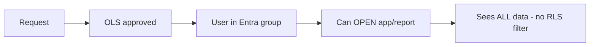

---

## 3. Use Case: RLS Only (No OLS)

**What’s approved:** RLS only. No OLS (no audience/report/Entra group).

**Result:** User has a row filter defined but **cannot open** the app/report (no group membership). RLS is useless until they also get OLS.

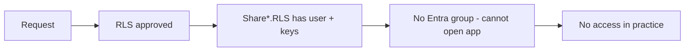

---

## 4. Use Case: Both OLS and RLS

**What’s approved:** OLS (access to app/report) and RLS (which rows they can see).

**Result:** User can open the app and sees **only** the rows allowed by RLS.

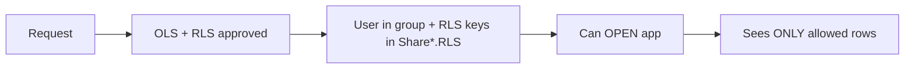

---

## 5. Summary: All Three Cases

```mermaid
flowchart TB
    subgraph OLS_only["OLS only"]
        O1[Request] --> O2[OLS approved]
        O2 --> O3[User in group]
        O3 --> O4[Can open app - Sees ALL data]
    end

    subgraph RLS_only["RLS only"]
        R1[Request] --> R2[RLS approved]
        R2 --> R3[Share*.RLS has keys]
        R3 --> R4[Cannot open app - No OLS]
    end

    subgraph Both["Both OLS + RLS"]
        B1[Request] --> B2[OLS + RLS approved]
        B2 --> B3[User in group + RLS keys]
        B3 --> B4[Can open app - Sees ONLY allowed rows]
    end
```

| Case | Can open app/report? | What data they see |
|------|----------------------|---------------------|
| **OLS only** | Yes | All data (no RLS filter) |
| **RLS only** | No | Nothing (can't open it) |
| **Both** | Yes | Only rows allowed by RLS |

---

## 6. Managed OLS Only — End-to-End

Full flow from request to user in Entra group (managed apps only, OLSMode = 0).

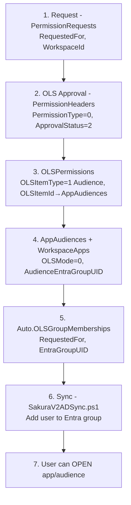

---

## 7. Managed OLS + RLS — End-to-End (Both Branches)

One request with both OLS and RLS; managed OLS path + RLS path to filtered data.

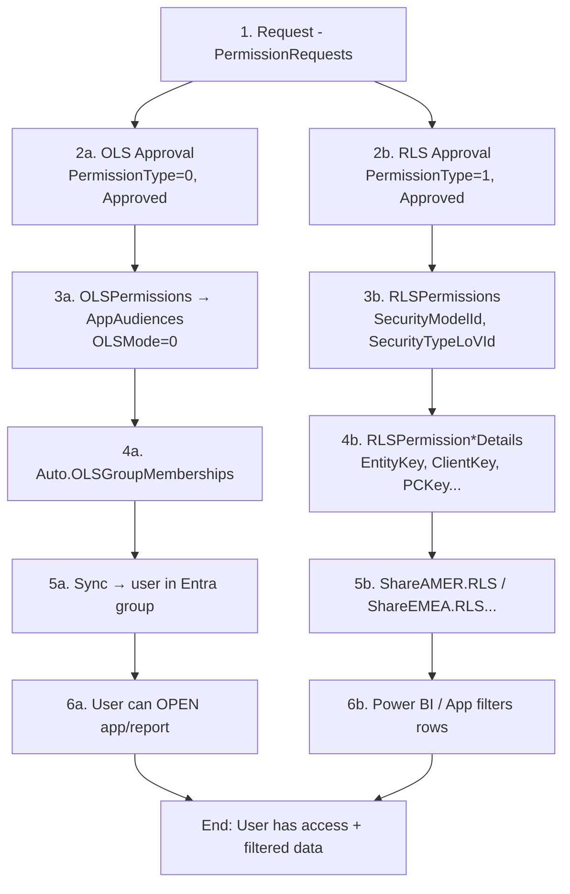

---

## 8. Managed vs Not Managed OLS (Split)

Where the OLS path splits: managed (sync) vs not managed (app owner).

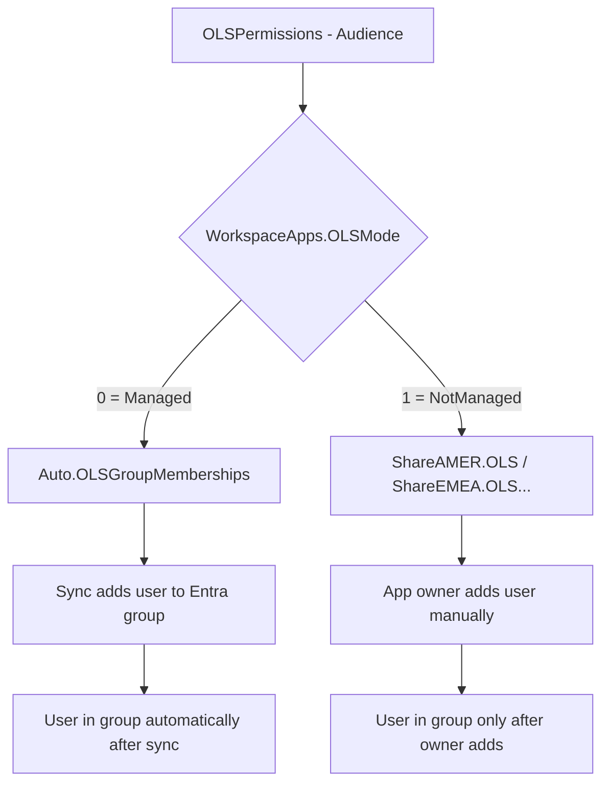

---

## 9. RLS Flow — Per Domain

RLS is stored per domain in detail tables and exposed via Share schema views.

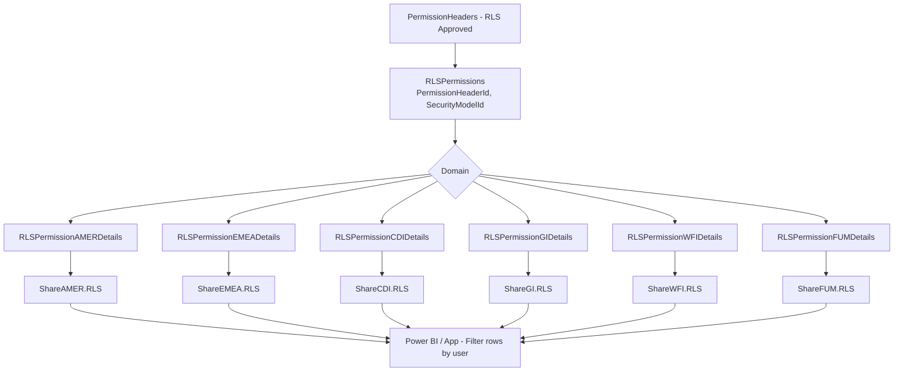

---

## 10. OLS Item Types (Audience vs Report)

OLS can point to an **audience** (app) or a **standalone report** (SAR). Only audiences with OLSMode=0 feed the managed sync.

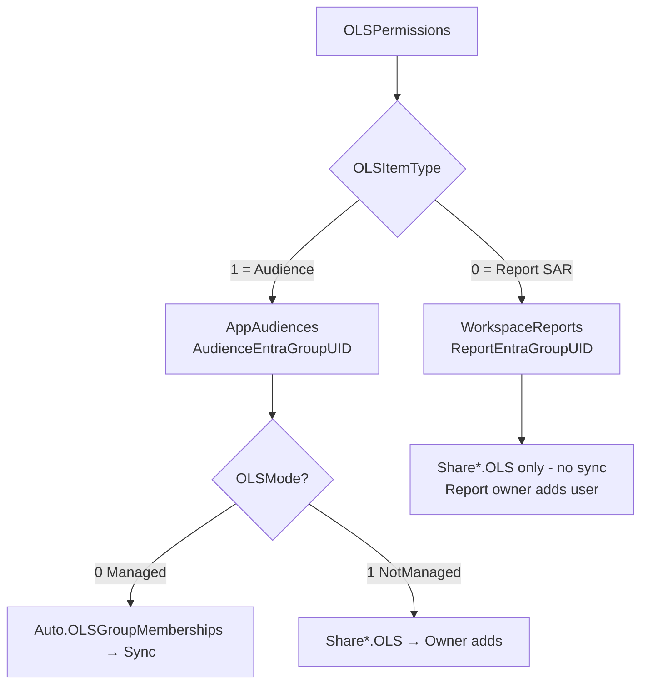

---

## 11. Sequence: Managed OLS + RLS (One User)

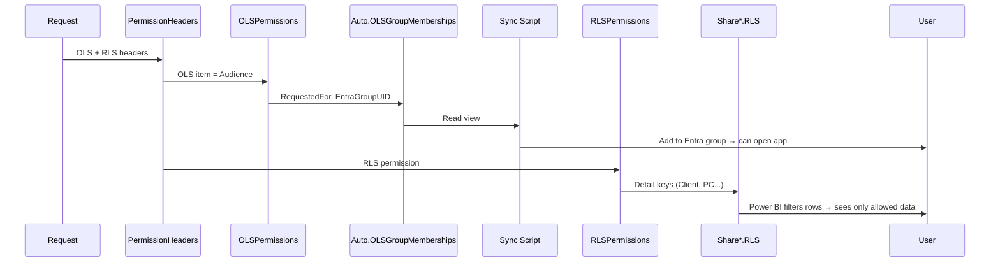

---

## Why “Same vs Separate AD Groups for OLS and RLS” Makes Sense in V1 but Not in V2

This section explains in detail why the question *“If we have the same AD group for OLS and RLS we have no issue; what if we have separate AD groups for OLS and RLS?”* is meaningful in **Sakura V1** but **does not apply** in **Sakura V2**.

---

### V1: One Mechanism for Both OLS and RLS (Group-Driven)

In V1, **both** “can the user open the app?” (OLS) and “which rows can they see?” (RLS) were enforced by **the same thing**: **Azure AD group membership**.

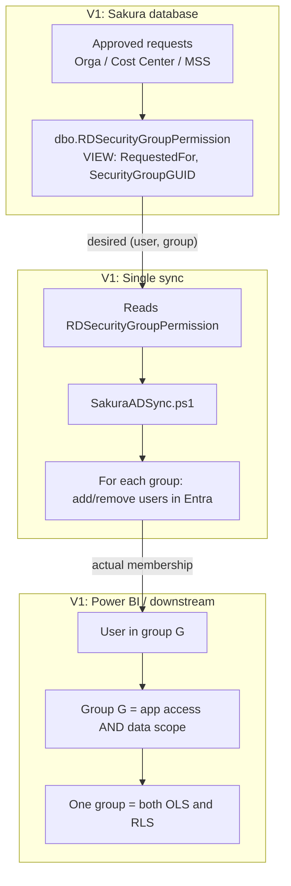

**What this means:**

1. **One view:** `RDSecurityGroupPermission` produced rows like `(RequestedFor, SecurityGroupGUID)`. That view was built from approved requests (Orga, Cost Center, MSS). There was **no separate** “OLS table” vs “RLS table” for sync — one view encoded “this user should be in this group.”
2. **One sync script:** `SakuraADSync.ps1` read that view and updated Entra so that membership matched. So **one pipeline** fed **all** security groups used for access.
3. **One meaning per group:** In Power BI (or the semantic model), **each group** effectively meant both:
   - **OLS:** “User can open this app/report” (because the app was configured to allow that group).
   - **RLS:** “User sees this data scope” (because the report’s RLS rules were written to use **group membership** — e.g. “if user is in #SG-UN-SAKURA-FIN then show rows where Entity = X”).

So in V1, **OLS and RLS were not separate pipelines** — they were **two uses of the same AD group membership**.

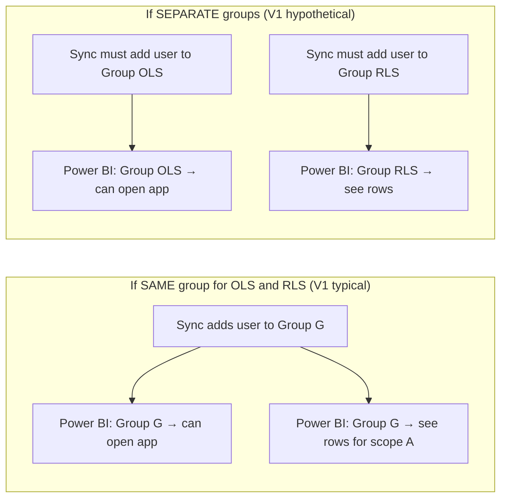

**Why the question makes sense in V1:**

- **Same group:** One sync run adds the user to one group; that group is used for both “can open” and “which rows.” No gap.
- **Separate groups:** You would need the sync to add the user to **both** “OLS group” and “RLS group.” If the view or script only fed one of them, the user would have app access but no data (or the reverse). So the question “what if we have separate AD groups for OLS and RLS?” is exactly about: *we must ensure both groups get the right members from the same source of truth.*

So in V1, the question is **valid and important**: it’s about whether one group carries both meanings or two groups do, and in the latter case, ensuring the **same** sync/view populates **both**.

---

### V2: Two Completely Separate Mechanisms (OLS = Groups, RLS = Views)

In V2, OLS and RLS use **different mechanisms**. Only OLS uses AD groups; RLS does **not** use AD groups at all.

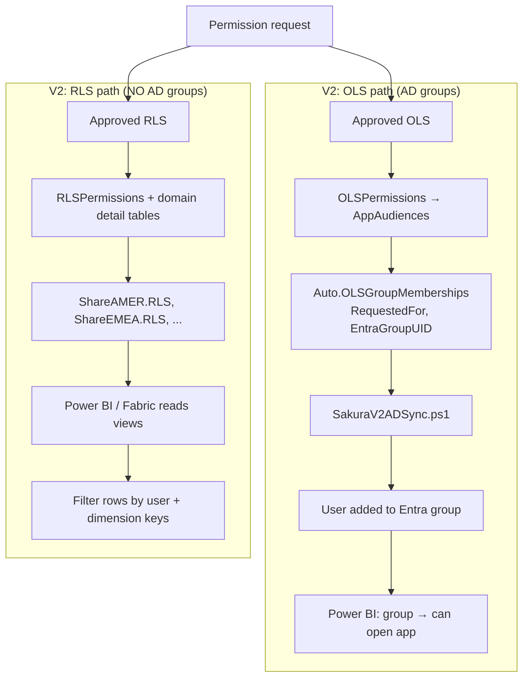

**What this means:**

1. **OLS:** Stored in `OLSPermissions` (and related tables). The **only** place that drives AD group membership is `Auto.OLSGroupMemberships`. The sync script reads **only** that view and updates **only** Entra. So in V2, **only OLS** is “group-driven.”
2. **RLS:** Stored in `RLSPermissions` and domain detail tables (e.g. `RLSPermissionEMEADetails`). It is exposed to downstream via **Share*.RLS views**. Power BI (or Fabric) reads those views (or tables built from them) and applies row filters by **user identity + dimension keys**. There is **no** “RLS group” and **no** sync that adds users to an “RLS group.”
3. So in V2 there is **no** “same AD group for OLS and RLS” vs “separate AD groups for OLS and RLS” — because **RLS does not use any AD group** in the design.

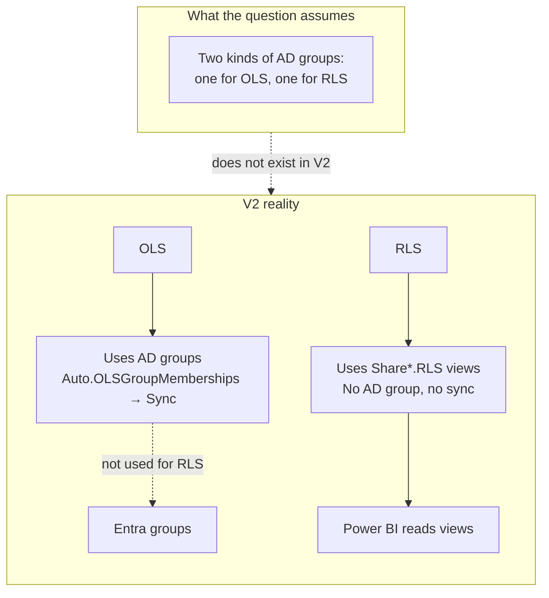

**Why the question does not apply in V2:**

- There is **no** “RLS AD group” maintained by Sakura. The sync script does **not** add users to any group for RLS.
- So you **cannot** have “the same AD group for OLS and RLS” in the V2 sense — OLS has groups, RLS has views.
- You also **cannot** have “separate AD groups for OLS and RLS” in the V2 design — there is only one set of groups (OLS), and RLS is handled entirely outside the group/sync pipeline.

The question implicitly assumes **both** OLS and RLS are enforced via AD groups (same or different). That is true in V1; it is **false** in V2 for RLS.

---

### Side-by-Side Summary (Mermaid)

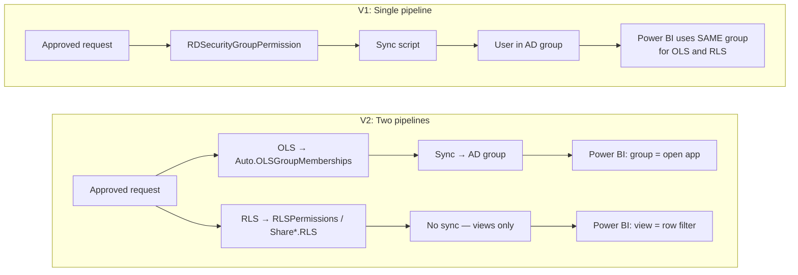

| | V1 | V2 |
|---|----|----|
| **OLS** | AD group (from RDSecurityGroupPermission) | AD group (from Auto.OLSGroupMemberships + sync) |
| **RLS** | **Same AD group** (group membership = data scope) | **No AD group** — Share*.RLS views, read by Power BI |
| **Sync script** | One script updates all groups used for both OLS and RLS | One script updates **only** OLS groups |
| **“Same vs separate AD groups for OLS and RLS?”** | **Makes sense** — both go through groups; same = one group, separate = two groups to populate | **Does not apply** — RLS has no AD group in the design |

---

### One-Sentence Takeaway

- **V1:** OLS and RLS were both enforced by **group membership**, so the question “same group vs separate groups?” is about how many groups you use and whether the sync fills both.
- **V2:** OLS is enforced by **group membership**; RLS is enforced by **views** (Share*.RLS). There is no “RLS group,” so the question does not apply.

---

## Proposal: One AD Group for App-Level OLS + RLS; Separate Groups per Audience

### What is proposed (summary)

- **One shared AD group per app** (or per workspace) that is used for **both**:
  - **App-level OLS** — “can open this app”
  - **RLS** — “has data access” (Power BI uses this group for the RLS role / data scope)
- When a user is added to this **one** group, they get app access and data scope without any manual “add to RLS group” step.
- **Separate AD groups per audience** — “which audience(s) can this user see?” (e.g. Finance Audience, Exec Audience). These stay as today: Sakura’s OLS sync adds/removes users to **audience** groups from `Auto.OLSGroupMemberships` (using `AudienceEntraGroupUID`).
- So: **shared group = app + data access** (one add, no manual RLS group); **audience groups = which content/audience** (existing OLS sync).

---

### Diagram: Current vs proposed

**Today (current):** Sync only fills **per-audience** groups. If Power BI uses a *different* group for RLS, that RLS group is never filled by Sakura → someone must add users manually.

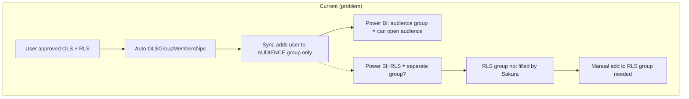

**Proposed:** One shared group (app + RLS) filled by Sakura; audience groups still filled by existing sync. No manual RLS group.

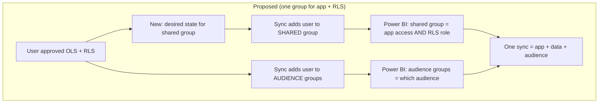

**Group layout (proposed):**

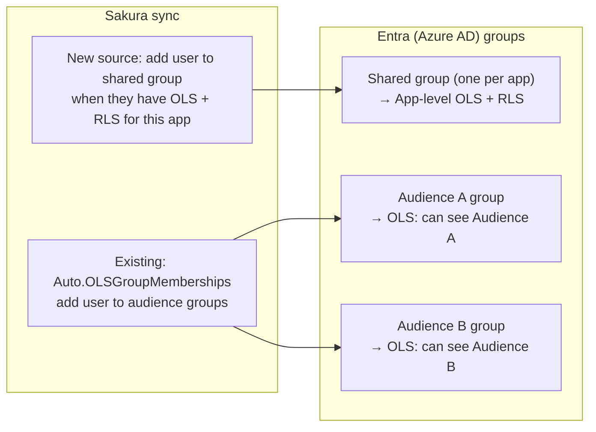

---

### Architecture changes needed to support this

| Layer | Change | Description |
|-------|--------|-------------|
| **1. Database** | Store the “app + RLS” group ID | Add a column (or use existing `WorkspaceApps.AppEntraGroupUID`) to hold the **shared** Entra group GUID for “app-level OLS + RLS.” If the group is per workspace instead of per app, add/store it on Workspaces. |
| **2. Database** | New view (or extend existing) | Create a view that returns desired **(RequestedFor, EntraGroupUID)** for the **shared** group: include a user when they have **both** (a) approved OLS to at least one audience in that app (or workspace), and (b) approved RLS for that workspace/domain. Same shape as `Auto.OLSGroupMemberships` (RequestedFor, EntraGroupUID, LastChangeDate) so the sync can read it. Example name: `Auto.AppRLSGroupMemberships` or extend logic in sync to also read “app+RLS” memberships from a second view. |
| **3. Sync script** | Read two sources | `SakuraV2ADSync.ps1` today only reads `[Auto].[OLSGroupMemberships]`. Extend it to **also** read the new view (e.g. `Auto.AppRLSGroupMemberships`) and merge the desired (user, group) list so that the script adds/removes users in **both** the shared app+RLS group and the per-audience groups. Same diff-and-update logic, just more groups. |
| **4. Downstream (Power BI)** | Config only | Configure the app so that the **shared** group is used both for “who can open the app” and for the **RLS role** (data scope). No Sakura code change; see “What Power BI people need to know” below. |

Summary: **DB** = store shared group GUID + new view; **Sync** = read that view and sync it like audience groups; **Power BI** = use shared group for app + RLS.

---

### What Power BI / report owners need to know (plain explanation)

**Who this is for:** People who configure Power BI apps, workspaces, and RLS roles (e.g. report owners, workspace admins, BI team).

**What we’re doing:**  
We use **one** Entra (Azure AD) group for both “can open this app” and “which data (RLS) this user can see.” That one group is kept in sync by Sakura when users are approved for both app access and data access. **Separate** groups per audience still decide “which audience(s)” the user sees; those are also synced by Sakura.

**What you need to do:**

1. **Create (or designate) one Entra group per app** that will mean: “member = can open this app **and** has RLS data access.” Give that group’s GUID to the Sakura team so it can be stored and synced (see architecture above).
2. **In Power BI:**
   - **App access:** Assign this **same** group to the app (or workspace) so that members can open the app.
   - **RLS (recommended — keep Share*.RLS):** Treat the shared group as a **gate** (“user is allowed RLS for this app”). The **actual row filter** should still come from **Share*.RLS** (or the security tables built from it): filter rows by user identity + dimension keys from the view. Do **not** use the shared group as the RLS role that defines data scope, or Share*.RLS is bypassed and the original plan is broken. So: shared group = app access + “has RLS”; Share*.RLS = which rows they see.
3. **Audience groups:** Keep using the **per-audience** Entra groups (managed by Sakura) to control which audience(s) a user is in. Sakura will continue to add/remove users to those audience groups when they are approved for OLS to that audience.
4. **Result:** When Sakura adds a user to the shared group, they automatically get app access and data access. When Sakura adds them to an audience group, they get that audience. No manual step to “add to RLS group.”

**If you currently use a different group for RLS:**  
Switching to this model means: stop using that separate RLS-only group and use the **shared** (app + RLS) group for both app permission and the RLS role. After that, Sakura sync will fully maintain who has data access via that one group.

---

### Does this break the Share* domain RLS (original plan)? — Important

**Original V2 plan:** RLS is **view-driven**. Approved RLS is stored in `RLSPermissions` + domain detail tables and exposed via **Share*.RLS** (ShareAMER.RLS, ShareEMEA.RLS, etc.). Power BI (or Fabric) reads these views (or tables built from them) and filters rows by **user + dimension keys**. There is **no** AD group for RLS in that design; the view is the source of truth for “which rows this user sees.”

**Risk if we use the shared group as the RLS role:**  
If Power BI is configured so that “members of the shared group” get a **fixed** data scope (e.g. one role = one set of dimension values), then **group membership** would define row-level access and **Share*.RLS would no longer drive** the actual filter. That would **break or sideline** the original domain RLS view logic: per-user, per-domain dimension keys in Share*.RLS would be ignored for that app.

**Recommended approach — do not break Share*.RLS:**

- Use the **shared group** only for:
  - **App-level OLS** — who can open the app.
  - **Gate** — “this user is allowed to have RLS for this app” (so we sync them into the group when they have both OLS and RLS approval).
- Keep **Share*.RLS as the source of truth** for **which rows** each user sees. Power BI (or the downstream pipeline) should **still read Share*.RLS** (or the security tables built from it) and apply the row filter by **user identity + dimension keys** from the view. The shared group does **not** replace the view; it only ensures the user is in the app and is eligible for RLS.
- Result: No manual “add to RLS group”; Sync adds user to shared group when they have OLS + RLS. **Actual data scope** still comes from Share*.RLS → original plan intact.

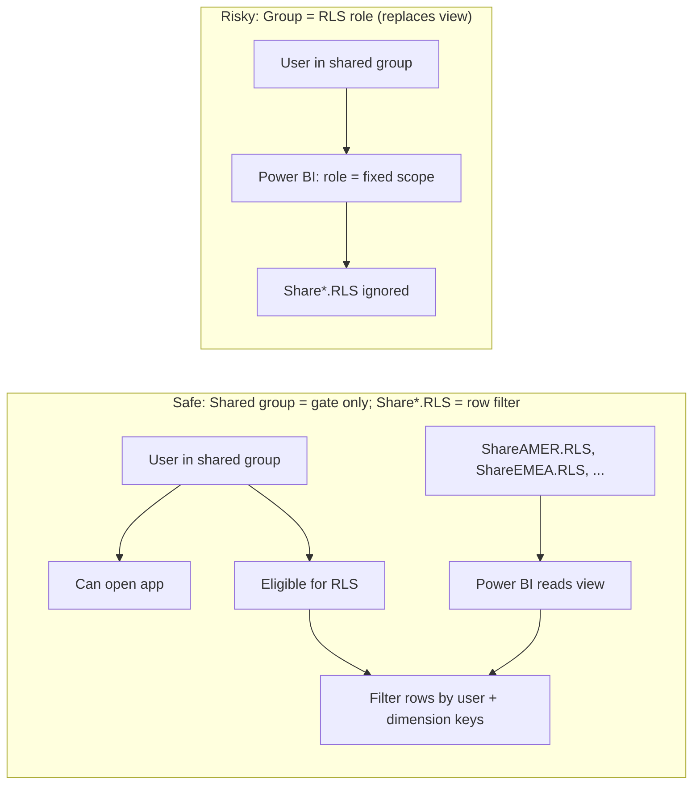

**Summary:** The proposal (one AD group for app-level OLS + RLS, separate groups per audience) **does not have to** break Share* domain RLS. Use the shared group as **app access + gate**; keep **Share*.RLS** as the source of truth for row-level scope. If instead the downstream uses the shared group **as** the RLS role (group membership = data scope), then yes — that would break the original view-based RLS plan for that app.

---

## Reference: Key Tables and Views

| Purpose | Table / View |
|--------|---------------|
| Request | `dbo.PermissionRequests` |
| OLS/RLS approval | `dbo.PermissionHeaders` (PermissionType 0=OLS, 1=RLS) |
| OLS item | `dbo.OLSPermissions` → AppAudiences or WorkspaceReports |
| RLS permission | `dbo.RLSPermissions` → `dbo.RLSPermission*Details` (per domain) |
| Managed OLS sync source | `Auto.OLSGroupMemberships` |
| Not-managed OLS (owner view) | `ShareAMER.OLS`, `ShareEMEA.OLS`, ... |
| RLS (per domain) | `ShareAMER.RLS`, `ShareEMEA.RLS`, ... |
